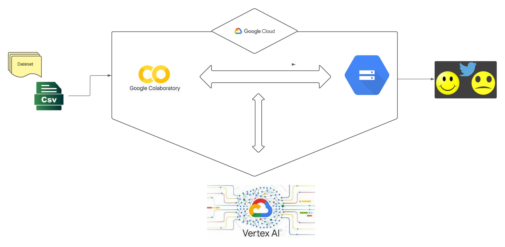

# Vertex AI SDK: AutoML Text Sentiment Analysis

## Introduction
This project demonstrates the use of Vertex AI SDK to train and deploy an AutoML text sentiment analysis model. It focuses on analyzing the sentiment of tweets, utilizing Google Cloud's ML services and resources.


## Installation
To set up this project:

1. Clone this repository to your local machine.
2. Ensure you have Python installed.
3. Install the required libraries as detailed in the `autoML(1).ipynb` notebook.

## Usage
Follow the steps in the `autoML(1).ipynb` notebook:

1. **Dataset Preparation**: Utilizing the Twitter sentiment dataset of 1m6.
2. **Model Training**: Create a Vertex AI Dataset resource and train the AutoML model.
3. **Model Evaluation**: View the model evaluation metrics.
4. **Deployment and Prediction**: Deploy the model to a Vertex AI Endpoint and make online predictions.
5. **Cleanup**: Steps to undeploy the model and clean up resources.

### Integrating CSV Data into Google Cloud Platform (GCP)
To incorporate CSV data into GCP and perform the necessary preprocessing, follow these steps:

1. **Data Storage on GCP**: 
   a. **Create a Bucket on Google Cloud Storage**:
      - Log in to your GCP account.
      - Navigate to "Storage" and create a new bucket.
      - Follow the instructions to name your bucket and configure its settings (such as the region).
   b. **Upload the CSV File to the Bucket**:
      - Once the bucket is created, use the Google Cloud user interface to upload your CSV file.
      - Alternatively, use the `gsutil cp` command line to upload the file. For example:
        
        ```
        gsutil cp [FILE_NAME] gs://[BUCKET_NAME]/[OBJECT_NAME]
       
        ```
## Workflow Overview
The project workflow is as follows:
- Data is sourced and pre-processed into a CSV format.
- The CSV is uploaded to Google Cloud Storage.
- Google Colaboratory is used for interacting with the data and training the model via Vertex AI.
- The trained model is then used to analyze tweet sentiment, resulting in a labeled dataset indicating sentiments.
    
   

     
## Contributing
Please read [CONTRIBUTING.md](CONTRIBUTING.md) for details on our code of conduct, and the process for submitting pull requests to us.

## License
This project is licensed under the Apache License, Version 2.0 - see the [LICENSE.md](LICENSE.md) file for details

## Acknowledgments
Special thanks to Google Cloud Platform for providing the Vertex AI SDK and the Twitter sentiment dataset of 1m6.

